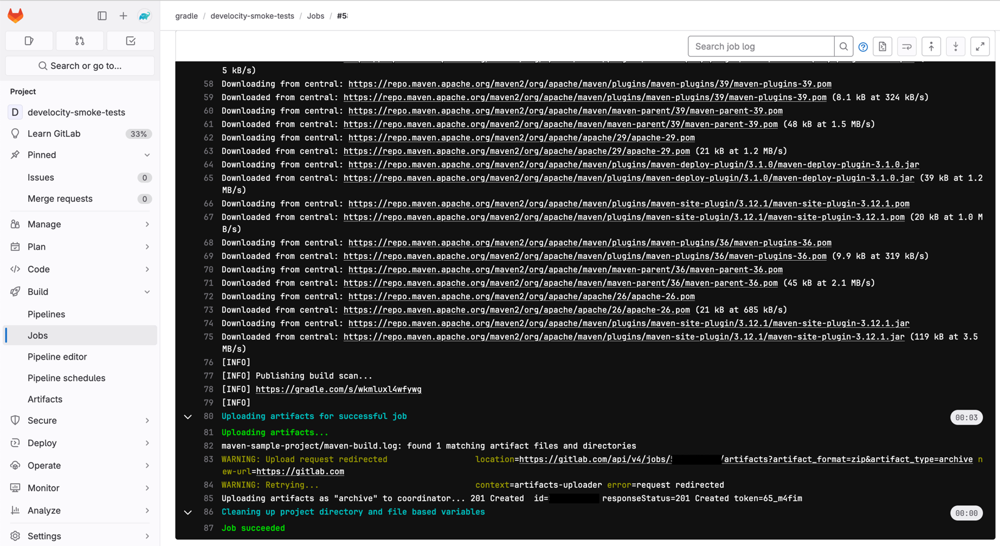

# Gradle Enterprise GitLab Templates

## Overview
These GitLab templates integrate with Gradle Enterprise for Gradle and Maven builds run via GitLab. Build scans are available as a free service on [scans.gradle.com](https://scans.gradle.com/) and commercially via [Gradle Enterprise](https://gradle.com/).



For each Gradle and Maven build that is run from GitLab, these templates exposes the links to the created Build Scan® in the CI job logs.
The templates can also be configured to ad-hoc connect Gradle and Maven builds to an existing Gradle Enterprise instance such that a Build Scan® is published each time a build is run from GitLab.


## Requirements
- GitLab 15.11 since they use inputs, see https://docs.gitlab.com/ee/ci/yaml/includes.html#define-inputs-for-configuration-added-with-include-beta.
- Shell with curl should be available on the executor
- Network access to download from Maven central and from GitHub (those URLs can be customized, see [Configuration](#Configuration)

## Configuration
### Gradle Auto-instrumentation
Include the remote template and optionally pass inputs.
To enable Build Scan publishing for Gradle builds, the configuration would look something like presented below (using https://gradle-enterprise.mycompany.com/ as an example of Gradle Enterprise server URL.

```yml
include:
  - remote: 'https://raw.githubusercontent.com/gradle/gradle-enterprise-gitlab-templates/main/gradle-enterprise-gradle.yml'
    inputs:
      url: https://gradle-enterprise.mycompany.com

build-gradle-job:
  stage: build
  before_script:
    - !reference [.injectGradleEnterpriseForGradle]
  script:
    - ./gradlew check -I $GRADLE_ENTERPRISE_INIT_SCRIPT_PATH # Will publish a build scan to https://gradle-enterprise.mycompany.com
```
The `.injectGradleEnterpriseForGradle` creates an init script with the instrumentation logic and exports the path as `$GRADLE_ENTERPRISE_INIT_SCRIPT_PATH` environment variable.
For all other options see `inputs` section in [gradle-enterprise-gradle.yml](gradle-enterprise-gradle.yml).

> **_NOTE:_** The build is also instrumented with our [Common Custom User Data Gradle plugin](https://github.com/gradle/common-custom-user-data-gradle-plugin) as well, as it will provide more details about your build.

### Maven Auto-instrumentation
Include the remote template and optionally pass inputs.
To enable Build Scan publishing for Maven builds, the configuration would look something like presented below (using https://gradle-enterprise.mycompany.com/ as an example of Gradle Enterprise server URL.

```yml
include:
  - remote: 'https://raw.githubusercontent.com/gradle/gradle-enterprise-gitlab-templates/main/gradle-enterprise-maven.yml'
    inputs:
      url: https://gradle-enterprise.mycompany.com

build-maven-job:
  stage: build
  before_script:
    - !reference [.injectGradleEnterpriseForMaven]
  script:
    - ./mvnw clean verify # Will publish a build scan to https://gradle-enterprise.mycompany.com
```

The `.injectGradleEnterpriseForMaven` downloads the extensions and references them in `MAVEN_OPTS`. 
For all other options see `inputs` section in [gradle-enterprise-maven.yml](gradle-enterprise-maven.yml).

> **_NOTE:_** This instrumentation defines the environment variable `MAVEN_OPTS` taken into account by Maven builds. If `MAVEN_OPTS` is redefined, the instrumentation won't work

> **_NOTE:_** The build is also instrumented with our [Common Custom User Data Maven extension](https://github.com/gradle/common-custom-user-data-maven-extension) as well, as it will provide more details about your build

### Gradle and Maven Auto-instrumentation
If you have both Gradle and Maven builds in a pipeline, you can simply just include both templates:

```yml
include:
  - remote: "https://raw.githubusercontent.com/gradle/gradle-enterprise-gitlab-templates/main/gradle-enterprise-gradle.yml"
    inputs:
      url: https://gradle-enterprise.mycompany.com
  - remote: "https://raw.githubusercontent.com/gradle/gradle-enterprise-gitlab-templates/main/gradle-enterprise-maven.yml"
    inputs:
      url: https://gradle-enterprise.mycompany.com

build-maven-job:
  stage: build
  before_script:
    - !reference [.injectGradleEnterpriseForMaven]
  script:
    - ./mvnw clean verify # Will publish a build scan to https://gradle-enterprise.mycompany.com

build-gradle-job:
  stage: build
  before_script:
    - !reference [.injectGradleEnterpriseForGradle]
  script:
    - ./gradlew check -I $GRADLE_ENTERPRISE_INIT_SCRIPT_PATH # Will publish a build scan to https://gradle-enterprise.mycompany.com
```

### Auto-instrumentation compatibility
The following sections list the compatibility of the instrumented Gradle Enterprise Gradle plugin and Gradle Enterprise Maven extension with the Gradle Enterprise version based on the given build tool in use.
#### For Gradle builds
For Gradle builds the version used for the Gradle Enterprise Gradle plugin can be defined with the `gradlePluginVersion` input. The compatibility of the specified version with Gradle Enterprise can be found [here](https://docs.gradle.com/enterprise/compatibility/#gradle_enterprise_gradle_plugin).
For the Common Custom User Data Gradle plugin which is defined with the `ccudPluginVersion` input, you can see the compatibility of the specified version with the Gradle Enterprise Gradle plugin [here](https://github.com/gradle/common-custom-user-data-gradle-plugin#version-compatibility).

#### For Maven builds
For Maven builds the version used for the Gradle Enterprise Maven extension can be defined with the `mavenExtensionVersion` input. The compatibility of the specified version with Gradle Enterprise can be found [here](https://docs.gradle.com/enterprise/maven-extension/#compatibility_with_apache_maven_and_gradle_enterprise).
For the Common Custom User Data Maven extension which is defined with the `ccudMavenExtensionVersion` input, you can see the compatibility of the specified version with the Gradle Enterprise Maven extension [here](https://github.com/gradle/common-custom-user-data-maven-extension#version-compatibility).

## Authentication
To authenticate against the Gradle Enterprise server, you should specify a masked environment variable named `GRADLE_ENTERPRISE_ACCESS_KEY`.
See https://docs.gitlab.com/ee/ci/variables/#define-a-cicd-variable-in-the-ui on how to do this in GitLab UI.
To generate a Gradle Enterprise Access Key, you can check https://docs.gradle.com/enterprise/gradle-plugin/#manual_access_key_configuration for Gradle and https://docs.gradle.com/enterprise/maven-extension/#manual_access_key_configuration for Maven.

## License
This project is available under the [Apache License, Version 2.0](https://github.com/gradle/gradle-enterprise-bamboo-plugin/blob/main/LICENSE).
